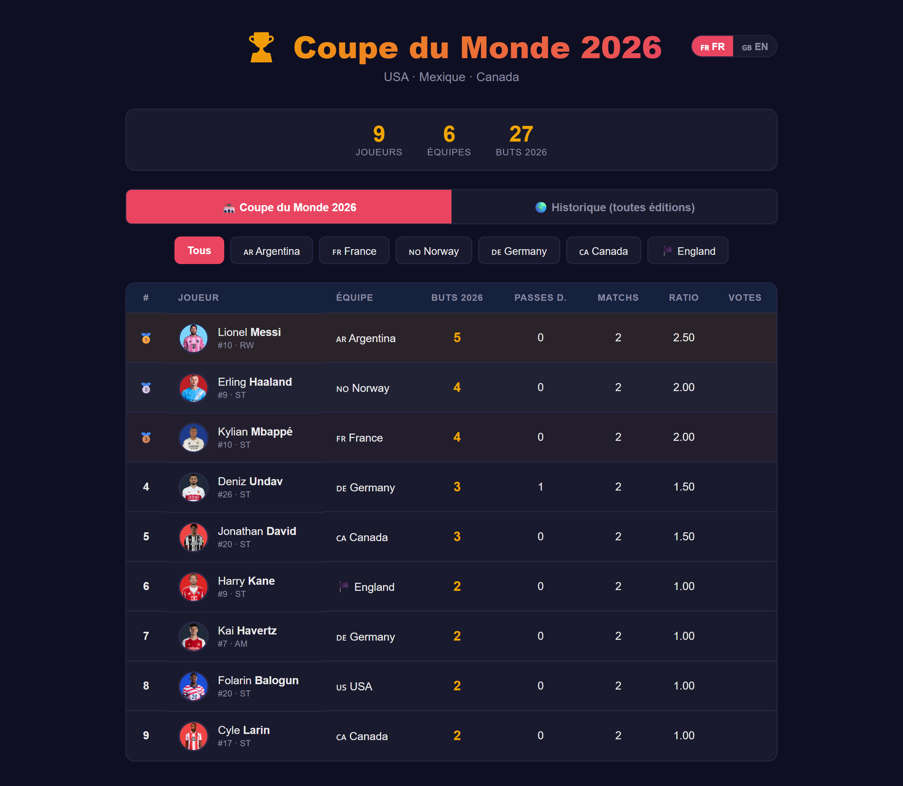
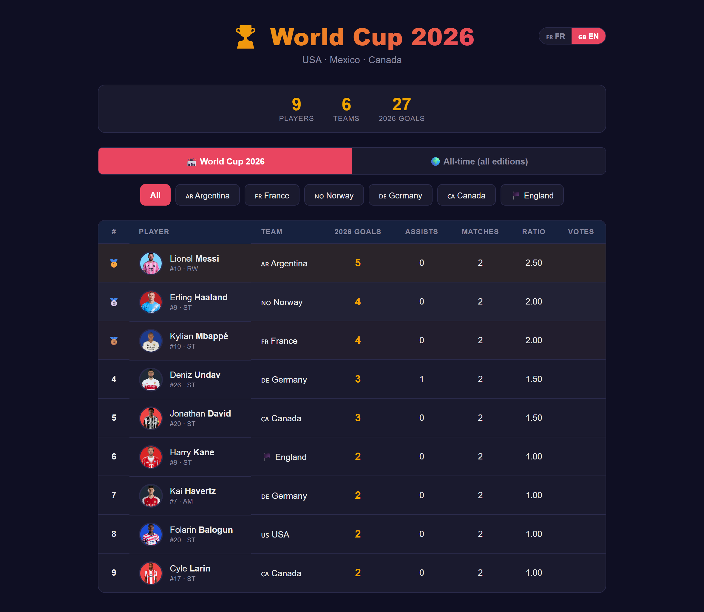
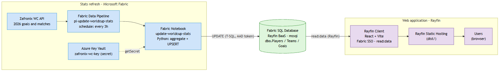

# ⚽ World Cup Top Scorer

A real-time web app showing the **World Cup 2026 top-scorers leaderboard**, built end to end on **[Rayfin](https://aka.ms/rayfin)** and **Microsoft Fabric**.

Rayfin provides the **database, authentication (Fabric SSO) and hosting** in a single command — the whole infrastructure is managed on Fabric. A scheduled Fabric pipeline keeps the statistics up to date automatically.

🌐 The UI is **bilingual (FR / EN)** with a one-click language toggle.

📐 **Detailed architecture → [`docs/ARCHITECTURE.md`](docs/ARCHITECTURE.md)**

## Preview

| Leaderboard (FR) | Leaderboard (EN) |
|---|---|
|  |  |

| Sign-in (Fabric SSO) |
|---|
|  |

## Architecture



> Editable diagram: [`docs/architecture.excalidraw`](docs/architecture.excalidraw) · full write-up in [`docs/ARCHITECTURE.md`](docs/ARCHITECTURE.md).

## Features

- 🏆 **WC 2026** scorers leaderboard + **all-time** leaderboard (legends included)
- 🌐 **FR / EN** language switch (persisted in `localStorage`)
- 🖼️ Player photos and flags
- ⭐ Favourites with named voting
- 🔄 Stats refreshed **automatically every 3 hours** through a Fabric pipeline
- 🔐 **Fabric SSO** authentication, no secret in the code

## Stack

React 19 · Vite · TypeScript · **Rayfin** (SQL BaaS + Auth + Hosting) · Microsoft Fabric (SQL Database, Data Pipeline, Notebook) · Azure Key Vault

## Structure

```
.
├── src/                 # React frontend (App, Leaderboard, TeamFilter, i18n, rayfinClient)
├── rayfin/
│   ├── data/            # Data model entities (Team, Player, Goal, Favorite)
│   └── rayfin.yml       # Rayfin config: auth, data (mssql), static hosting
├── scripts/seed.ts      # Data seeding through the Rayfin API
├── fabric/              # Fabric Pipeline + Notebook that refresh the stats
└── docs/                # Architecture + diagram + screenshots
```

## Getting started

> Prerequisites: Node 18+, Rayfin CLI (`npx @microsoft/rayfin-cli`), access to a Microsoft Fabric workspace.

```bash
npm install

# Generate the Rayfin env variables (.env.local) from rayfin/.env
npx rayfin env --framework vite

# Run the frontend in dev mode
npm run dev

# Production build (served by Rayfin Static Hosting)
npm run build
```

Deploy the app (data + auth + hosting) to Fabric with the Rayfin CLI:

```bash
npx rayfin deploy
```

## Automatic stats update (Fabric)

The [`fabric/`](fabric) folder contains the **Notebook** and **Data Pipeline** that refresh `dbo.Players` (goals, matches played) from the Zafronix World Cup API, scheduled every 3 hours, with the API key stored in **Azure Key Vault**. Details and redeployment: [`fabric/README.md`](fabric/README.md).

## Security

No secret is committed. API keys live in Azure Key Vault; the `.env*`, `rayfin/.env*`, `rayfin/.deployments.json` and `*.local` files are git-ignored. The Rayfin `publishableKey` (`pk-…`) is a public client-side key and is safe to commit.
