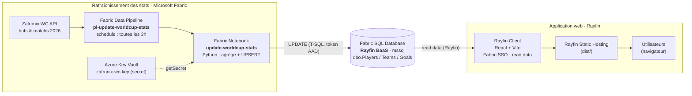

# Architecture — World Cup Top Scorer

Une application web temps réel qui affiche le classement des **meilleurs buteurs de la Coupe du Monde 2026**, construite de bout en bout sur **[Rayfin](https://aka.ms/rayfin)** et **Microsoft Fabric**.

> 💡 **Le point clé : Rayfin fournit en une seule commande la base de données, l'authentification (Fabric SSO) et l'hébergement statique.** Pas d'infra à gérer — on code, Rayfin déploie sur Fabric.

## Vue d'ensemble



> Schéma éditable : [`architecture.excalidraw`](./architecture.excalidraw) (ouvrir dans <https://aka.ms/excalidraw>).

## Les deux plans

### 1. Le plan applicatif — **100 % Rayfin**

| Service Rayfin | Rôle dans l'app | Config (`rayfin/rayfin.yml`) |
|---|---|---|
| **Data (BaaS)** | Base SQL managée (dialect `mssql`) générée depuis les entités TypeScript décorées (`@entity`, `@uuid`, `@one`…) | `data.enabled: true` |
| **Auth** | Authentification **Fabric SSO** + scopes `read:data` / `write:data` | `auth.fabric.enabled: true` |
| **Static Hosting** | Build Vite (`dist/`) servi sur `*.webapp.fabricapps.net` | `staticHosting.enabled: true` |

Les entités du modèle de données (dossier `rayfin/data/`) :

```
Team   ── id, name, code, group
Player ── id, firstName, lastName, number, position,
          goals, assists, matchesPlayed, allTimeGoals, team_id → Team
Goal   ── id, scorer_id → Player, minute, matchDescription, goalType, matchDate
Favorite ── id, userName, player_id → Player
```

À partir de ces classes, Rayfin **scaffolde et déploie** la base SQL sur Fabric, expose une API typée (`RayfinClient<AppSchema>`) et gère le SSO — sans écrire une ligne de SQL ni de backend.

### 2. Le plan data — **Microsoft Fabric** (voir [`/fabric`](../fabric))

Un pipeline planifié maintient les statistiques à jour automatiquement :

1. **Pipeline** `pl-update-worldcup-stats` se déclenche **toutes les 3 heures**.
2. Il exécute le **Notebook** `update-worldcup-stats` (Python).
3. Le notebook récupère sa clé API depuis **Azure Key Vault** (`notebookutils.credentials.getSecret`) — **aucun secret en dur**.
4. Il appelle la **Zafronix World Cup API** (`/matches?year=2026`), agrège buts et apparitions par joueur depuis les matchs terminés (matching de noms tolérant aux accents et aux noms composés).
5. Il écrit dans la **même base SQL Rayfin** via T-SQL paramétré (`UPDATE dbo.Players SET goals = ?, matchesPlayed = ?`), authentifié par un **token AAD** de l'identité runtime du notebook.
6. Le champ historique `allTimeGoals` n'est jamais modifié.

L'app Rayfin lit ensuite ces données rafraîchies via le BaaS — la boucle est bouclée.

## Sécurité

- **Aucun secret dans le code ou le repo.** La clé API vit dans **Azure Key Vault** (`kv-wc-*`, secret `zafronix-wc-key`). Le notebook la lit au runtime ; elle peut aussi être passée en paramètre sécurisé du pipeline (`apiKey`) pour un run manuel.
- **Auth de bout en bout via Fabric / Entra ID** : le frontend via Fabric SSO, l'accès SQL via token AAD, Key Vault via access policy.
- `.gitignore` exclut `.env*`, `rayfin/.env*`, `rayfin/.deployments.json` et tous les fichiers `*.local`.

## Stack

| Couche | Techno |
|---|---|
| Frontend | React 19, Vite 8, TypeScript |
| Plateforme app | **Rayfin** (BaaS SQL, Auth Fabric SSO, Static Hosting) |
| Données | Microsoft Fabric SQL Database |
| Orchestration | Fabric Data Pipeline + Notebook (Python) |
| Secrets | Azure Key Vault |
| Source de données | Zafronix World Cup API |
