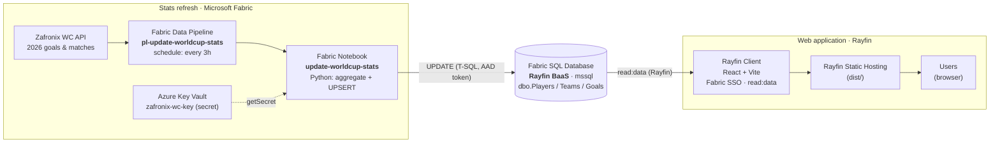
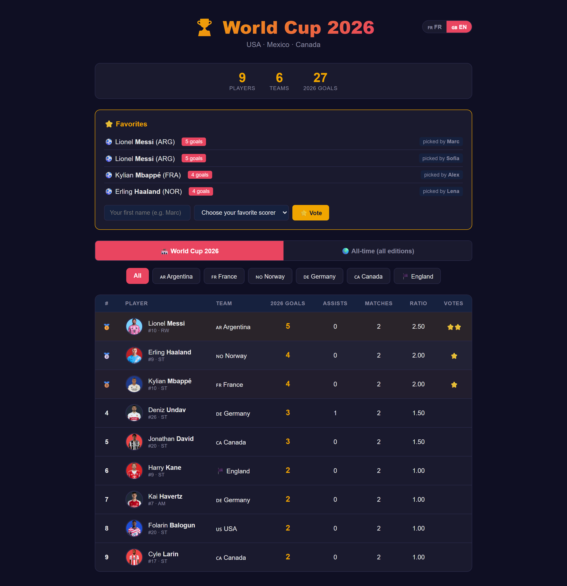
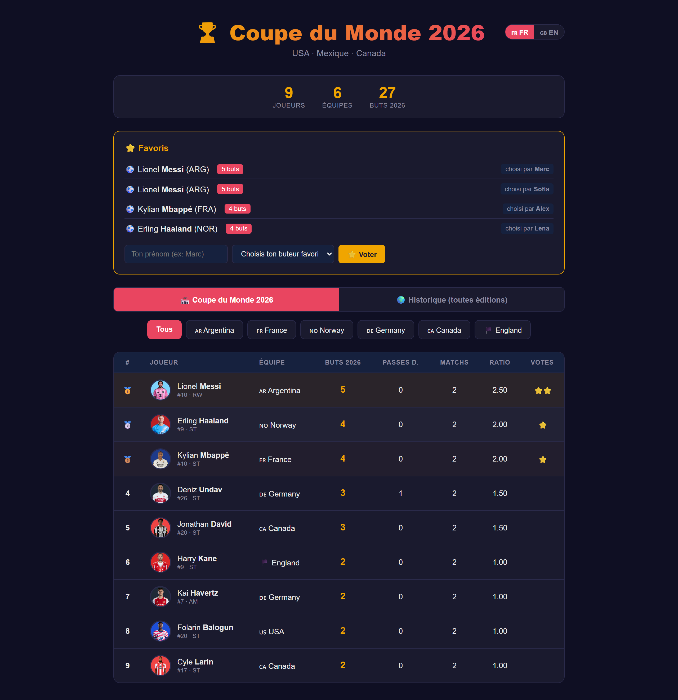

# Architecture — World Cup Top Scorer

A real-time web app that shows the **World Cup 2026 top-scorers** leaderboard, built end to end on **[Rayfin](https://aka.ms/rayfin)** and **Microsoft Fabric**.

> 💡 **The key point: Rayfin provides the database, authentication (Fabric SSO) and static hosting in a single command.** No infrastructure to manage — you write code, Rayfin deploys to Fabric.

## Overview



> Editable diagram: [`architecture.excalidraw`](./architecture.excalidraw) (open in <https://aka.ms/excalidraw>). A rendered PNG is available at [`architecture.png`](./architecture.png).

## App preview



| Sign-in (Fabric SSO) | Leaderboard (FR) |
|---|---|
|  |  |

## The two planes

### 1. The application plane — **100 % Rayfin**

| Rayfin service | Role in the app | Config (`rayfin/rayfin.yml`) |
|---|---|---|
| **Data (BaaS)** | Managed SQL database (`mssql` dialect) generated from the decorated TypeScript entities (`@entity`, `@uuid`, `@one`…) | `data.enabled: true` |
| **Auth** | **Fabric SSO** authentication + `read:data` / `write:data` scopes | `auth.fabric.enabled: true` |
| **Static Hosting** | Vite build (`dist/`) served on `*.webapp.fabricapps.net` | `staticHosting.enabled: true` |

The data-model entities (`rayfin/data/` folder):

```
Team   ── id, name, code, group
Player ── id, firstName, lastName, number, position,
          goals, assists, matchesPlayed, allTimeGoals, team_id → Team
Goal   ── id, scorer_id → Player, minute, matchDescription, goalType, matchDate
Favorite ── id, userName, player_id → Player
```

From these classes Rayfin **scaffolds and deploys** the SQL database on Fabric, exposes a typed API (`RayfinClient<AppSchema>`) and handles SSO — without writing a single line of SQL or backend code.

### 2. The data plane — **Microsoft Fabric** (see [`/fabric`](../fabric))

A scheduled pipeline keeps the statistics up to date automatically:

1. The **pipeline** `pl-update-worldcup-stats` triggers **every 3 hours**.
2. It runs the **notebook** `update-worldcup-stats` (Python).
3. The notebook reads its API key from **Azure Key Vault** (`notebookutils.credentials.getSecret`) — **no hard-coded secret**.
4. It calls the **Zafronix World Cup API** (`/matches?year=2026`) and aggregates goals and appearances per player from the finished matches.
5. **Scorer-name cleaning**: Zafronix scorer strings carry noise such as `Havertz 45+5' pen`, `Kane 12' pen` or `Al-Arab 76' o.g`. The notebook strips the minute/penalty suffixes, **excludes own goals**, and matches names tolerantly (accent-insensitive, compound surnames, leading initials like `J. David`).
6. Before applying the new values it **purges** the current 2026 stats (`goals`, `matchesPlayed` reset to 0) so stale values are cleared, then writes back through parameterized T-SQL (`UPDATE dbo.Players SET goals = ?, matchesPlayed = ?`), authenticated by an **AAD token** from the notebook's runtime identity.
7. The historical `allTimeGoals` field is never modified.

The Rayfin app then reads this refreshed data through the BaaS — the loop is closed.

## Security

- **No secret in the code or the repo.** The API key lives in **Azure Key Vault** (`kv-wc-*`, secret `zafronix-wc-key`). The notebook reads it at runtime; it can also be passed as a secure pipeline parameter (`apiKey`) for a manual run.
- **End-to-end auth through Fabric / Entra ID**: the frontend via Fabric SSO, SQL access via AAD token, Key Vault via access policy.
- `.gitignore` excludes `.env*`, `rayfin/.env*`, `rayfin/.deployments.json` and all `*.local` files.

## Stack

| Layer | Technology |
|---|---|
| Frontend | React 19, Vite 8, TypeScript |
| App platform | **Rayfin** (SQL BaaS, Fabric SSO Auth, Static Hosting) |
| Data | Microsoft Fabric SQL Database |
| Orchestration | Fabric Data Pipeline + Notebook (Python) |
| Secrets | Azure Key Vault |
| Data source | Zafronix World Cup API |
